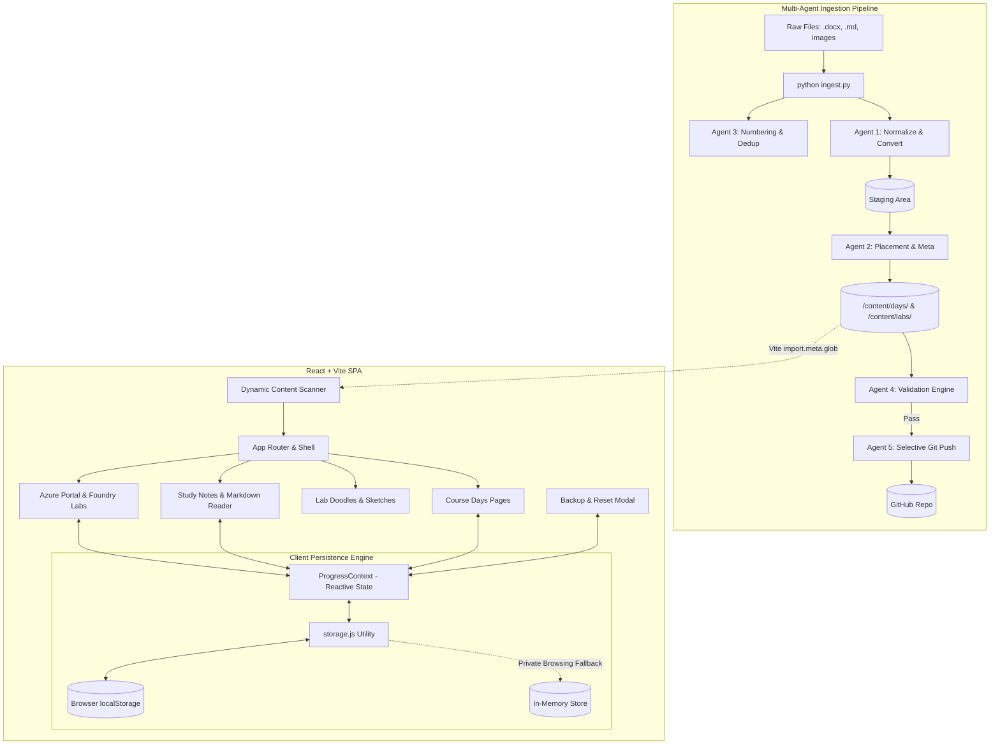

# Azure MLOps Class Notes Portal — AI-300

A high-performance, responsive web application and multi-agent content ingestion system for the **Machine Learning Operations Engineer Associate (AI-300 & DP-100)** curriculum.

Built with **Vite**, **React**, **Tailwind CSS**, and an automated **Python Multi-Agent Content Ingestion Orchestrator**.

---

## Architecture Overview



---

## Project Structure

```
d:/ai300/
├── content/                              # Folder-driven static curriculum content
│   ├── days/                             # Course day folders (Day 1, Day 2, etc.)
│   │   └── day-01/
│   │       ├── meta.json                 # Day title, subtitle, description
│   │       ├── summary.md                # Markdown daily executive summary
│   │       ├── links.json                # Structured resource and doc links
│   │       └── transcripts/              # Session transcripts in Markdown
│   │           ├── transcript-1.md
│   │           └── transcript-2.md
│   └── labs/                             # Lab exercise content
│       ├── azure-portal/                 # Azure Portal labs
│       └── foundry/                      # Microsoft Foundry labs
│
├── orchestrator/                         # Multi-agent ingestion engine (Python)
│   ├── agent1_convert.py                 # Agent 1: Normalize & Convert (.docx -> Markdown)
│   ├── agent2_placement.py               # Agent 2: Placement into content/ & meta builder
│   ├── agent3_numbering.py               # Agent 3: Sequential numbering & dedup scanner
│   ├── agent4_validation.py              # Agent 4: File integrity & cross-check validator
│   ├── agent5_git.py                     # Agent 5: Selective staging, commit & safe push
│   ├── config.py                         # File patterns, platforms, known lab titles
│   ├── dialogs.py                        # Native OS file dialogs with terminal fallback
│   ├── logger.py                         # Dual console & .ingest_logs/ writer
│   └── cli.py                            # Interactive CLI wizard
│
├── src/                                  # Frontend source code (React + Vite)
│   ├── assets/                           # Vector icons, illustrations, hero image
│   ├── components/
│   │   ├── DoodleCard.jsx                # Visual lab sketch preview card
│   │   ├── EmptyState.jsx                # Friendly placeholder states
│   │   ├── LabCard.jsx                   # Lab list item with live status badge
│   │   ├── LabProgressPanel.jsx          # Live progress overview & resume card
│   │   ├── Layout.jsx                    # Docked sidebar, topbar, mobile drawer
│   │   ├── MarkdownView.jsx              # Markdown renderer with code highlighting
│   │   ├── PlatformSwitcher.jsx          # Azure Portal ↔ Foundry selector
│   │   ├── ProgressSettingsModal.jsx     # Export/Import JSON & Reset modal
│   │   └── StatusBadge.jsx               # Not Started / In Progress / Completed badge
│   ├── context/
│   │   └── ProgressContext.jsx           # Global reactive state synchronizer
│   ├── data/
│   │   ├── days.js                       # Dynamic folder scanner (import.meta.glob)
│   │   └── labs.js                       # Lab catalogue definition & metadata
│   ├── hooks/
│   │   └── useLabState.js                # Backwards-compatible progress hook
│   ├── pages/
│   │   ├── AzurePortalLabs.jsx           # Azure Portal lab catalog view
│   │   ├── CourseDayPage.jsx             # 3-tab day view (Transcripts, Summary, Links)
│   │   ├── FoundryLabs.jsx               # Microsoft Foundry lab catalog view
│   │   ├── LabDoodles.jsx                # Visual doodles and architectural sketches
│   │   └── StudyNotes.jsx                # Deep-dive lab notes, links, personal notes
│   ├── utils/
│   │   └── storage.js                    # Storage layer (localStorage + in-memory fallback)
│   ├── App.jsx                           # Application routes & provider wrapping
│   ├── config.js                         # Global course branding & metadata
│   └── index.css                         # Tailwind CSS and typography tokens
│
├── tests/
│   └── test_ingest.py                    # Unit & integration test suite (12 tests)
├── ingest.py                             # Root CLI entry point for content ingestion
├── package.json                          # Node.js dependencies & scripts
└── vite.config.js                        # Vite bundler configuration
```

---

## Core System Concepts

### 1. Folder-Driven Course Days Engine
Course Days follow an **automation-ready, folder-driven architecture**:
- **Zero Component or Routing Edits**: A day exists if and only if its directory exists under `/content/days/day-XX/`. Adding a folder immediately discovers it at build/dev time; deleting a folder cleanly removes it from the sidebar and routes.
- **Self-Contained Content**:
  - `meta.json`: Holds metadata (`day`, `title`, `subtitle`, `description`).
  - `transcripts/*.md`: Session transcripts rendered with an interactive **"Click to Read"** accordion reader.
  - `summary.md`: Full formatted daily summary rendered with styled headings, callouts, and lists.
  - `links.json`: Resource cards with direct links to official Microsoft documentation and repos.
- **Build-Time Discovery**: Uses Vite's `import.meta.glob` to index and sort days numerically in ascending order without manual manifests.

### 2. Browser Storage Persistence Layer (Zero-Backend)
All per-student progress persists strictly in client-side storage, with no server-side database or user login required:
- **Consolidated Storage Schema**: Saved under a single namespaced key (`mlops-portal:progress:v1`), capturing lab statuses, custom student notes, and "Mark as Read" toggles.
- **Safe Fallback**: Includes automated `localStorage` capability checks. If running in restricted or private browsing modes where storage throws errors, it smoothly falls back to an in-memory session store without crashing.
- **Zero State Drift**: Managed via `ProgressContext`, ensuring that changing a lab's status on `StudyNotes.jsx` instantly updates `AzurePortalLabs.jsx` and the right-hand **Progress Overview** stats card without requiring a page reload.
- **Interactive Personal Study Notes**: Every lab includes a dedicated student notes editor for recording DP-100 / AI-300 exam observations and pipeline notes.
- **Progress Backup & Transfer**:
  - **Export Progress**: Download progress as a clean `.json` file.
  - **Import Progress**: Restore or transfer progress across browsers or devices.
  - **Reset Progress**: Clear progress back to default `not-started` states with confirmation.

### 3. Multi-Agent Content Ingestion Orchestrator (`ingest.py`)
A Python CLI pipeline designed to take raw course materials (primarily `.docx`, but also `.md`, `.txt`, and images) and ingest them into canonical portal structures:
- **Agent 1 (Normalize & Convert)**: Converts `.docx` documents into clean Markdown, preserving `#` headings, bullet and numbered lists, inline `**bold**` and `*italic*` formatting, and markdown tables (`| ... |`). Operates safely inside a temporary staging directory (`.staging/`), leaving original files untouched.
- **Agent 2 (Placement)**: Moves normalized files to their destination paths (`/content/days/day-XX/` or `/content/labs/<platform>/<lab-id>/`), generates or updates `meta.json` and `links.json`, and strictly refuses to overwrite existing files without explicit CLI confirmation.
- **Agent 3 (Numbering & Dedup)**: Scans existing directories and suggests the next sequential number (e.g. Day 2 if Day 1 exists). Warns and requires confirmation if an existing number is overridden.
- **Agent 4 (Validation Engine)**: Performs strict pre-commit verification checking that all planned files exist, are non-empty, contain valid JSON/Markdown/Images, and have no gaps in transcript numbering. Produces a pass/fail report and blocks git actions if errors exist.
- **Agent 5 (Selective Git Push)**: Stages **only** the touched files (`git add <f1> <f2>...`), generates a descriptive commit message (e.g. `Add Day 2: 2 transcripts, summary`), and pushes to your current active branch while preserving local commits if remote pushes fail.
- **Native File Dialogs**: Launches native Windows file pickers (`tkinter.filedialog.askopenfilename`) labeled for each specific slot (`Select Transcript 2 of 4`, `Select Summary`, etc.) with graceful fallback to terminal path entry.

---

## Running Instructions

### Prerequisites
- **Node.js**: v18.0.0 or higher
- **Python**: v3.10 or higher with `pip`
- **Git**: Installed and configured

---

### 1. Frontend Portal (Vite + React)

#### Install Dependencies
```bash
npm install
```

#### Run Local Development Server
```bash
npm run dev
```
The application will launch locally at `http://localhost:5173/` (or the next available port).

#### Production Build
```bash
npm run build
```
Generates a production-ready, statically optimized bundle in `/dist` with zero errors.

#### Preview Production Build
```bash
npm run preview
```

---

### 2. Content Ingestion Orchestrator (Python CLI)

#### Install Python Dependencies
```bash
pip install python-docx Pillow
```

#### Run Content Ingestion Wizard
```bash
python ingest.py
```
This launches the interactive wizard:
1. Select whether you are ingesting a **Course Day** or a **Lab**.
2. Confirm or customize the proposed sequential number.
3. Use the native file-picker dialogs to select raw `.docx`, `.md`, or image files for each slot.
4. Review the Agent 4 validation report.
5. Confirm to selectively commit and push changes to GitHub.

#### View CLI Help
```bash
python ingest.py --help
```

#### Run Automated Test Suite
To run all unit and end-to-end integration tests for the multi-agent pipeline:
```bash
python -m unittest tests/test_ingest.py
```
*(All 12 tests run in an isolated sandbox and verify conversion, numbering, placement, validation, and git staging.)*

---

## Content Ingestion Walkthrough Example

### Adding a New Course Day
```
$ python ingest.py

================================================================
      AI-300 MULTI-AGENT CONTENT INGESTION ORCHESTRATOR
================================================================

What type of content would you like to ingest?
  [day] Course Day  (Transcripts, Summary, Links) (default)
  [lab] Lab Content (Notes, Doodle, Metadata)
Choice [day]: day

--- Day Ingestion Wizard ---
[Agent 3] Scanned existing days: [1]
Enter Day number [2]: 2
Day Title [Day 2]: Day 2
Day Subtitle/Topic (optional): Model Training & MLflow Tracking
Day Description (optional): Deep-dive into experiment tracking, MLflow metrics, and hyperparameter tuning.
How many transcripts for this day? [1]: 2

>> Opening file picker: Select Transcript 1 of 2 (docx, md, txt)
[Agent 1] Processing: session1_raw.docx -> transcript-1.md
[Agent 2] Placed file: transcript-1.md -> content/days/day-02/transcripts

>> Opening file picker: Select Transcript 2 of 2 (docx, md, txt)
[Agent 1] Processing: session2_raw.docx -> transcript-2.md
[Agent 2] Placed file: transcript-2.md -> content/days/day-02/transcripts

>> Opening file picker: Select Summary for Day 2 (docx, md, txt)
[Agent 1] Processing: day2_summary.docx -> summary.md
[Agent 2] Placed file: summary.md -> content/days/day-02

Optional: Add Important Links for this day.
Add any resource links now? (y/N): y
  Link 1 Label: MLflow Tracking in Azure ML
  Link 1 URL: https://learn.microsoft.com/azure/machine-learning/how-to-use-mlflow
  Link 1 Description: Official Azure documentation on MLflow integration.
  Link 2 Label: 

[Agent 2] Metadata saved: content/days/day-02/meta.json
[Agent 2] Links saved: content/days/day-02/links.json

================================================================
AGENT 4: VALIDATION REPORT
================================================================
[PASS]  content/days/day-02/transcripts/transcript-1.md Valid Markdown (42 lines, 2,840 bytes)
[PASS]  content/days/day-02/transcripts/transcript-2.md Valid Markdown (38 lines, 2,410 bytes)
[PASS]  content/days/day-02/summary.md                  Valid Markdown (25 lines, 1,650 bytes)
[PASS]  content/days/day-02/meta.json                   Valid JSON metadata (235 bytes)
[PASS]  content/days/day-02/links.json                  Valid links JSON with 1 items
[PASS]  content/days/day-02/transcripts                 All 2 transcripts sequentially ordered (1..2)
================================================================
Result: ALL CHECKS PASSED (6/6)
================================================================

Target Commit Message: "Add Day 2: 2 transcripts, summary"
Files to Stage (5):
  - transcript-1.md
  - transcript-2.md
  - summary.md
  - links.json
  - meta.json

Push to GitHub now? (Y/n) [Y]: Y
[Agent 5] Staging 5 files (selective git add)...
[SUCCESS] Committed: "Add Day 2: 2 transcripts, summary"
[Agent 5] Pushing commit to origin/main...
[SUCCESS] Pushed successfully to origin/main!
```

---

## Technical Specifications & Browser Support
- **Styling**: Tailwind CSS with custom Material Design 3 tokens and dark/light surface containers.
- **Icons & Typography**: Google Material Symbols Outlined and Google Fonts (Inter).
- **Markdown Rendering**: Custom regex-based Markdown view supporting headings, tables, blockquotes, lists, links, and code blocks.
- **Browser Compatibility**: Chrome, Edge, Firefox, Safari (desktop and mobile responsive).
