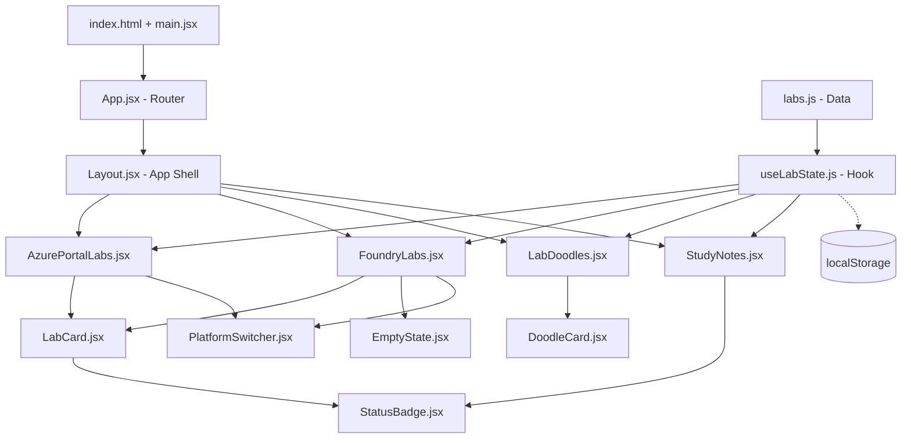

# MLOps Class-Notes Portal — Build Walkthrough

## What Was Built

A Vite + React SPA in `d:\ai300` implementing the Azure MLOps certification class-notes portal from the Stitch designs, with **all fabricated content stripped** and replaced with a clean, empty data structure.

### Architecture



---

### File Structure

| File | Purpose |
|------|---------|
| [labs.js](file:///d:/ai300/src/data/labs.js) | Single data source — 8 Azure labs, 0 Foundry labs, all fields empty |
| [useLabState.js](file:///d:/ai300/src/hooks/useLabState.js) | Custom hook with localStorage persistence for status changes |
| [Layout.jsx](file:///d:/ai300/src/components/Layout.jsx) | App shell: header, search, drawer sidebar, bottom nav |
| [LabCard.jsx](file:///d:/ai300/src/components/LabCard.jsx) | Lab list card — number badge, title, status, actions |
| [DoodleCard.jsx](file:///d:/ai300/src/components/DoodleCard.jsx) | Doodle grid card with empty-state placeholder |
| [StatusBadge.jsx](file:///d:/ai300/src/components/StatusBadge.jsx) | Status pill (not-started / in-progress / done) |
| [PlatformSwitcher.jsx](file:///d:/ai300/src/components/PlatformSwitcher.jsx) | Segmented control for Azure Portal ↔ Foundry |
| [EmptyState.jsx](file:///d:/ai300/src/components/EmptyState.jsx) | Clean "Foundry labs start soon" state |
| [AzurePortalLabs.jsx](file:///d:/ai300/src/pages/AzurePortalLabs.jsx) | Azure labs list view |
| [FoundryLabs.jsx](file:///d:/ai300/src/pages/FoundryLabs.jsx) | Foundry labs view (empty state) |
| [LabDoodles.jsx](file:///d:/ai300/src/pages/LabDoodles.jsx) | Doodle grid with platform filter tabs |
| [StudyNotes.jsx](file:///d:/ai300/src/pages/StudyNotes.jsx) | Per-lab detail: notes, links, doodle, status toggle |

---

## What Was Stripped from Stitch

All fabricated content from the auto-generated designs was removed:

- ❌ Invented lab descriptions (e.g., "Learn how to leverage Azure ML's capabilities...")
- ❌ Arbitrary status labels ("Completed", "In Progress" on specific labs)
- ❌ Technology chip tags (AutoML, SweepJob, etc.)
- ❌ Hardcoded progress stats ("2 / 8 Active")
- ❌ Fake "Quick Reference Card" with CLI commands
- ❌ Fabricated "Architecture & Commands" tab with YAML
- ❌ Invented "Core Objective" / "Key Workflow Steps" / "Exam Tips" sections
- ❌ Redundant Foundry coming-soon preview cards (Lab 9/10/11)
- ❌ "Visual Learning Tip" callout and draft count banners

**Replaced with**: Empty strings, null values, and clean placeholder states that say exactly what's missing (e.g., "Study notes not yet written — Add paraphrased notes for this lab in labs.js").

---

## Visual Verification

All 4 views verified via browser inspection with zero errors:

### View 1: Azure Portal Labs


### View 2: Foundry Labs (Empty State)


### View 3: Lab Doodles


### View 4: Study Notes (Lab 01)
````carousel

<!-- slide -->

````

### Browser Recording


---

## Build Verification

```
✓ npm run build — 0 errors, 0 warnings, built in 166ms
  dist/index.html            1.00 kB │ gzip:  0.58 kB
  dist/assets/index.css     25.42 kB │ gzip:  5.43 kB
  dist/assets/index.js     260.51 kB │ gzip: 79.73 kB
```

Dev server running at `http://localhost:5174/`.
